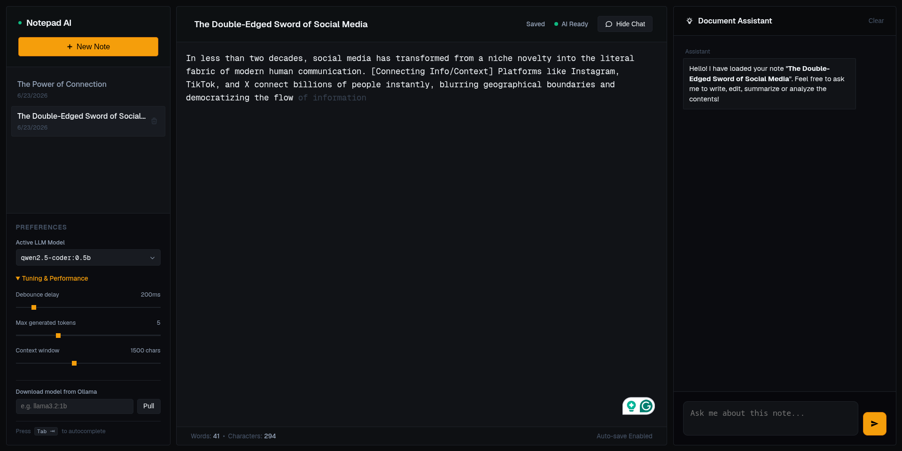

# Notepad AI

A local, privacy-focused smart notepad featuring next-word autocomplete and a document assistant chat panel. The application operates entirely offline, using local Ollama services for AI completions, making it fast, secure, and resource-efficient.



## Core Features

- **Inline Autocomplete**: Predicts next-word or next-phrase suggestions in real-time as you write. Press `Tab` to accept suggestions.
- **Document Assistant**: A built-in chat panel that automatically receives note contents as context. Ask it to outline, edit, translate, or summarize your notes.
- **Auto-Save**: Automatic debounced note saving to a local SQLite database. Commits edits 1.2 seconds after you stop typing.
- **Model Management**: Search, download, and switch between various Ollama models (e.g., Qwen2.5-Coder, Llama3.2) directly from the application interface.
- **Tuning Controls**: Adjustable sliders for debouncing delay, max autocomplete tokens, and context window lengths to optimize CPU usage.

## Requirements

To run this application locally, you need:

- **Operating System**: Linux, macOS, or Windows (I've used Fedora Workstation 44)
- **Node.js**: v18.0.0 or higher (NPM included)
- **Python**: v3.9 or higher
- **Ollama**: Installed and running locally

## Quick Start Setup

### 1. Start Ollama

Ensure the Ollama service is active and running:

```bash
ollama serve
```

### 2. Configure the Python Backend

Navigate to the `backend` directory, create a virtual environment, and install dependencies:

```bash
cd backend

# Create virtual environment
python3 -m venv venv

# Activate virtual environment
source venv/bin/activate  # On Windows, use: venv\Scripts\activate

# Install requirements
pip install -r requirements.txt
```

### 3. Configure the Next.js Frontend

Navigate to the `frontend` directory and install NPM packages:

```bash
cd ../frontend
npm install
```

## Running the Project

### 1. Run the Backend Server

Open a terminal in the `backend` directory and execute:

```bash
./run.py
```

_Note: If `run.py` is not marked executable, run `chmod +x run.py` first, or execute `python main.py` directly inside the virtual environment._

The backend service will boot on http://127.0.0.1:8000.

### 2. Run the Frontend Dev Server

Open a terminal in the `frontend` directory and execute:

```bash
npm run dev
```

The frontend application will start on http://localhost:3000.

## Hardware Tuning Tips (CPU Only)

For laptops running on CPU only:

- Use **`qwen2.5-coder:0.5b`** or **`qwen2.5-coder:1.5b`** for the fastest completion latencies.
- Keep the autocomplete context window around `1000` to `1500` characters to ensure prompt processing stays under 15ms.
- Set autocomplete length (`max_tokens`) between `3` and `5` tokens to keep response latency below 100ms.
